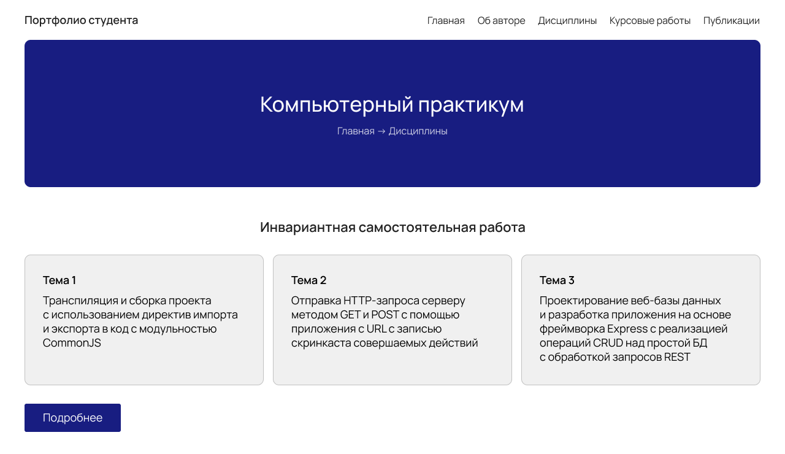

# Инвариантное самостоятельное задание 2.1

Создание дизайн-макета IT-продукта для компонента образовательной среды (или электронного образовательного ресурса)

Разработан макет главной страницы для ресурса **Веб-портфолио студента**:

