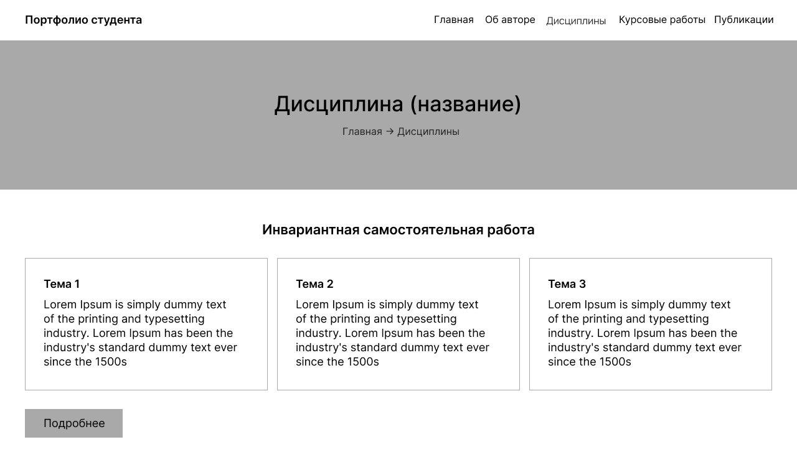

# Вариативное самостоятельное задание 2.2

Создание первоначального макета компоненты образовательной среды корпоративного обучения с использованием сервиса визуального проектирования

Макет разработан с использованием сервиса Figma.

Разработан предварительный макет главной страницы для ресурса **Веб-портфолио студента**:

