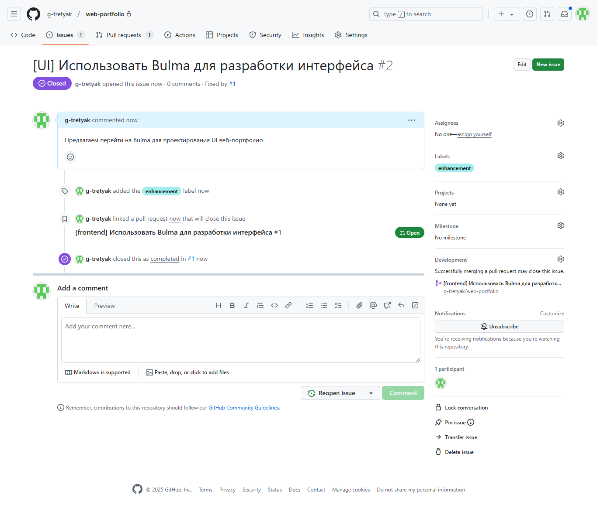

# Инвариантная самостоятельная работа 4.1

Изучив конкретную систему управления IT-проектами корпоративного обучения, использовав одну из стратегий ветвления (branching strategies) на основе сервиса GitHub реализовать добавление функции в существующем программном IT-проекте веб-ориентированной компоненте образовательной среды, предварительно создать запрос на добавление функционала (issue), спланировать временные затраты

## Стратегии ветвления

### Git Flow

Git Flow — это модель ветвления в Git, которая помогает организовать процесс разработки. Она включает две основные ветки: main для стабильных релизов и develop для текущей разработки. От develop создаются ветви функциональности (feature branches) для новых функций, которые после завершения сливаются обратно в develop. Когда команда готовит новый релиз, создается ветка релиза (release branch) от develop, которая дорабатывается и сливается как в main, так и в develop. Для срочных исправлений используются ветви исправлений (hotfix branches), которые создаются от main и сливаются обратно в обе ветки. Git Flow позволяет поддерживать порядок в разработке и выпуске продукта, хотя может быть избыточным для небольших проектов.

### GitHub Flow

GitHub Flow — это простая и легковесная модель ветвления, предназначенная для работы с Git и GitHub. Она подходит для проектов с непрерывной интеграцией и разработки, когда изменения вносятся часто. Основной принцип GitHub Flow заключается в создании короткоживущих веток, называемых ветками функциональности (feature branches), которые создаются от основной ветки `main`. Разработчики создают новую ветку для каждой функции или исправления, работают над ней, а затем открывают пулл-реквест (pull request) для обсуждения и рецензии изменений. После одобрения пулл-реквеста ветка сливается обратно в `main`. GitHub Flow является гибким и эффективным подходом, особенно для небольших команд и проектов, где важна скорость разработки и обновления.

### Trunk Based Development

Trunk Based Development (TBD) — это метод разработки, при котором все изменения в коде интегрируются в основную ветку (обычно называемую «trunk», «main» или «master») на постоянной основе. Главное отличие TBD заключается в том, что разработчики создают очень короткоживущие ветки или вовсе работают непосредственно в основной ветке, что сводит к минимуму время, в течение которого изменения остаются изолированными.

Вся команда работает над небольшими изменениями, которые часто сливаются в trunk, обычно несколько раз в день. Этот подход способствует быстрому обнаружению и устранению конфликтов, улучшению сотрудничества между разработчиками и уменьшению сложности выпуска новых версий.

Trunk Based Development хорошо работает в средах с высокими стандартами непрерывной интеграции и непрерывного развертывания (CI/CD), позволяя проектам оставаться актуальными и адаптивными к изменениям. Основной акцент TBD — на постоянной интеграции и быстром цикле обратной связи, что помогает поддерживать высокое качество кода.

## Выбор стратегии

Для работы выбрана стратегия GitHub Flow, т.к. это простая модель, которая подходит для небольших проектов. Применение GitHub Flow оправданно, если изменения вносятся часто. Модель обеспечивает быстрое внесение изменений.

## Добавление функциональности

Для добавления функциональности создаётся Issue в репозитории проекта на GitHub.

Для внесения правок в соответствии с моделью GitHub Flow создаётся feature-ветка. После разработки функциональности создаётся Pull request, который прикрепляется к Issue.

Если Pull request решает описанный в Issue запрос, производится слияние feature и main.

